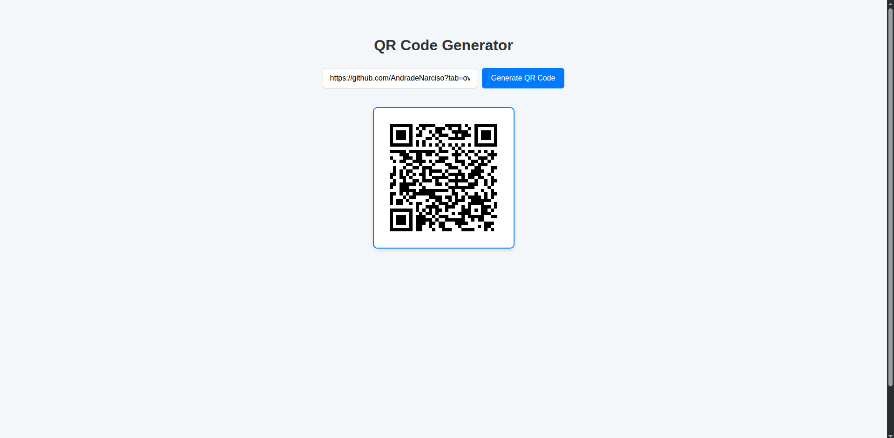

# QR_Code_Gererator

<p align="center">
  
</p>

This repository contains a **QR Code generator** built using **Spring Boot** and **Google ZXing**.  
The application provides an API endpoint that receives a URL and generates a QR Code image.

---

## Features
- Generate QR Codes from URLs
- Validate URL input before generating QR Code
- Returns QR Code in PNG format

---

## Technologies Used
- Java 21
- Spring Boot
- Google ZXing

---

## Usage
1. Clone the repository
   ```bash
   git clone https://github.com/AndradeNarciso/QR_Code_Gererator
2. Run the Spring Boot application
3. If the URL is valid, you will receive a QR Code
